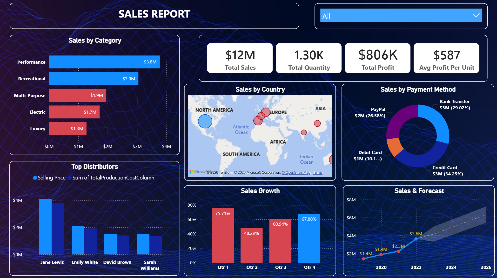
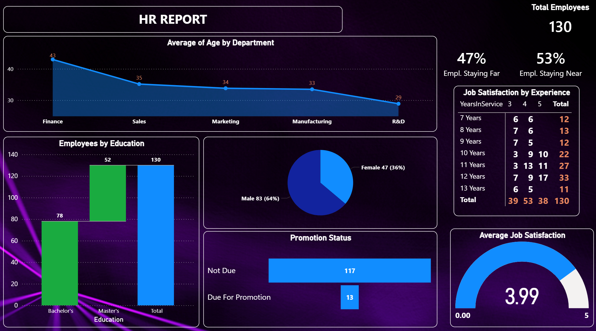

# WaveX Watercraft Sales & HR Dashboard (Power BI)

## Project Overview
This project is based on a real-world business scenario where I built interactive dashboards using Power BI to analyze sales and HR data for a fictional company, **WaveX Watercraft**.

The objective was to transform raw data into actionable insights and create visually compelling reports to support business decision-making.

### Dashboards Included
- Sales Analytics Dashboard  
- HR Analytics Dashboard  

---

## Business Problem
WaveX Watercraft required insights into:
- Sales performance across products and regions  
- Future sales forecasting  
- Employee distribution and HR analytics  

### Key Requirements:
- Exclude outdated data (before 2019)  
- Remove discontinued product (WR3)  
- Build a 2-year sales forecast  

---

## Dataset
The project uses multiple data sources:
- Sales data (Text file)  
- Company data (Excel)  
- Distributor data (PDF)  

> Data used in this project is available in the `/data` folder.

---

## Tools & Technologies
- Power BI Desktop  
- Power Query (ETL)  
- DAX (Data Analysis Expressions)  
- Data Modeling (Star Schema)  

---

## Data Preparation (ETL)
Key data transformation steps:
- Removed null values and duplicates  
- Cleaned and standardized column names  
- Merged and appended datasets  
- Created calculated columns (e.g., Profit, Profit per Unit)  
- Applied business filters (excluded WR3 and pre-2019 data)  

---

## Data Modeling
- Designed a **Star Schema** data model  
- Established relationships between:
  - Sales (fact table)  
  - Distributor, Product, Category (dimension tables)  

---

## Key Metrics (DAX)
Created key performance indicators such as:
- Total Sales  
- Total Profit  
- Quantity Sold  
- Year-over-Year Growth (%)  
- Employee Count  
- Average Job Satisfaction  

---

## Dashboard Features

### Sales Dashboard
- KPI Cards (Sales, Profit, Quantity, Avg Profit per Unit)  
- Sales by Category  
- Top Distributors  
- Sales Trend with Forecast  
- Sales by Country (Map)  
- Sales by Payment Method  
- Year Filter (Slicer)  

### HR Dashboard
- Employee Distribution (Gender, Department)  
- Average Age Analysis  
- Job Satisfaction Metrics  
- Employees Near vs Far from Office  
- Promotion Eligibility Insights  
- Experience vs Satisfaction Matrix  

---

## Forecasting
Implemented a **2-year sales forecast** using Power BI analytics tools to identify future trends and support planning decisions.

---

## Dashboard Preview

### Sales Dashboard
  
*Overview of sales performance, KPIs, and forecast trends.*

### HR Dashboard
  
*Insights into employee distribution, satisfaction, and workforce metrics.*

---

## How to Use
1. Download the `wavex-sales-hr-dashboard.pbix` file from this repository  
2. Open it using Power BI Desktop  
3. Use filters and slicers to explore different insights  

Tip: Interact with visuals to drill down into specific data points.

---

## Key Insights
- Identified top-performing product categories  
- Analyzed regional sales distribution  
- Evaluated employee satisfaction trends  
- Generated insights to support business and HR strategy  

---

## What I Learned
- End-to-end Power BI workflow (ETL → Modeling → Visualization)  
- Writing DAX measures and calculated columns  
- Designing interactive dashboards  
- Applying business logic to real-world scenarios  

---

> Note: This project is based on a guided course project and adapted for portfolio purposes.
